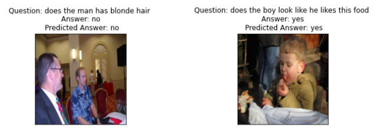
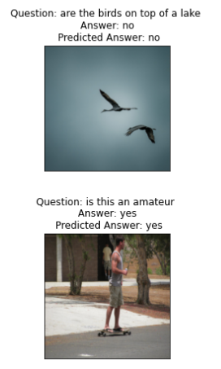

# **Visual Question Answering Task**
---------------------------------------------------------------------------------------------

## **Introduction**
--------------------------------

* Visual Question Answering (VQA) is a computer vision task where a system is given a text-based question about an image, and it must infer the answer.  
* The model will give the answer in yes/no type format.

## **Dataset**
--------------------------------
[Dataset](https://www.kaggle.com/datasets/rajatkumar794/visual-based-question-answering) is hosted on Kaggle and one can download it from [this](https://visualqa.org/download.html) site as well.

## **Preprocessing**
--------------------------------

* Removed Punctuations, Stopwords, Special Characters, Numbers, and unnecessary spaces.

## **Models**
--------------------------------

I have built 2 models for this task:

* **VQA Model 1** - This model is a combination of pretrained Resnet-52 and bi-layer LSTM with pretrained word embeddings from word2vec. The feature vector from both the model is then fused via late fusion. The model is trained on the VQA dataset. The model is trained for 10 epochs and the loss is 0.5. The model is saved in the [resnet_word2vec_model](https://drive.google.com/drive/folders/1TP79FlfRhC1ts7LHEa2Tl5sOj75P1PzW?usp=sharing) folder in drive along with optimizers.
    * The training results can be imporved by training the model for more epochs.
    * Also using different samplers too can improve the results.

* **VQA Model 2** - This model is a combination of transformers model BeIT and BERT. The feature vector from both the model is then fused via late fusion. The model is trained on the VQA dataset. The model is trained for 10 epochs and the loss is 0.5. The [model](https://huggingface.co/SmartPy/VQA-beit-bert-pt) is hosted on hub.
    * It didn't perform well as expected because late fusion is unable to capture different modalities.

## **Results**
--------------------------------
#### **VQA Model 1**
| Model | Accuracy | F1 Score |
| --- | --- | --- |
| VQA Model 1 | 0.51 |  0.61 |

#### **VQA Model 2**
| Model | Accuracy | F1 Score |
| --- | --- | --- |
| VQA Model 2 | 0.53 |  0.61 |

## **References**
--------------------------------
* [VQA: Visual Question Answering](https://arxiv.org/abs/1505.00468)
* [ViLT: Vision-and-Language Transformer Without Convolution or Region Supervision](https://arxiv.org/abs/2102.03334)

## **Libraries**
--------------------------------
* [PyTorch](https://pytorch.org/)
* [Transformers](https://huggingface.co/transformers/)
* [Pandas](https://pandas.pydata.org/)
* [Numpy](https://numpy.org/)
* [NLTK](https://www.nltk.org/)
* [Matplotlib](https://matplotlib.org/)
* [Seaborn](https://seaborn.pydata.org/)
* [Torchvision](https://pytorch.org/vision/stable/index.html)
* [Tqdm](https://tqdm.github.io/)
* [Scikit-learn](https://scikit-learn.org/stable/)
* [Gensim](https://radimrehurek.com/gensim/)
* [Plotly](https://plotly.com/python/)

## **Screenshots**
--------------------------------

